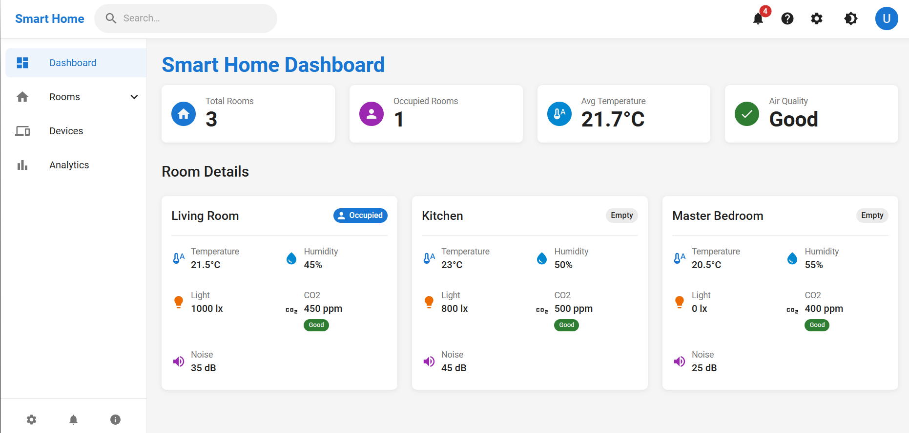
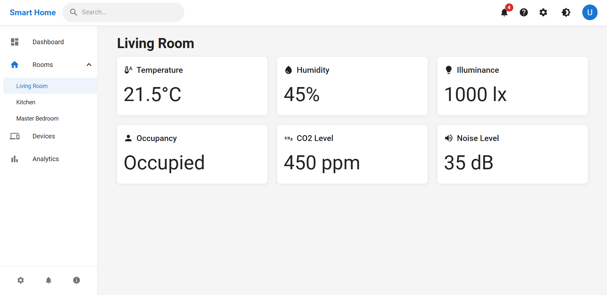
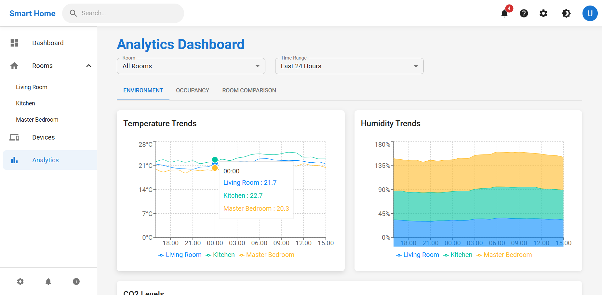
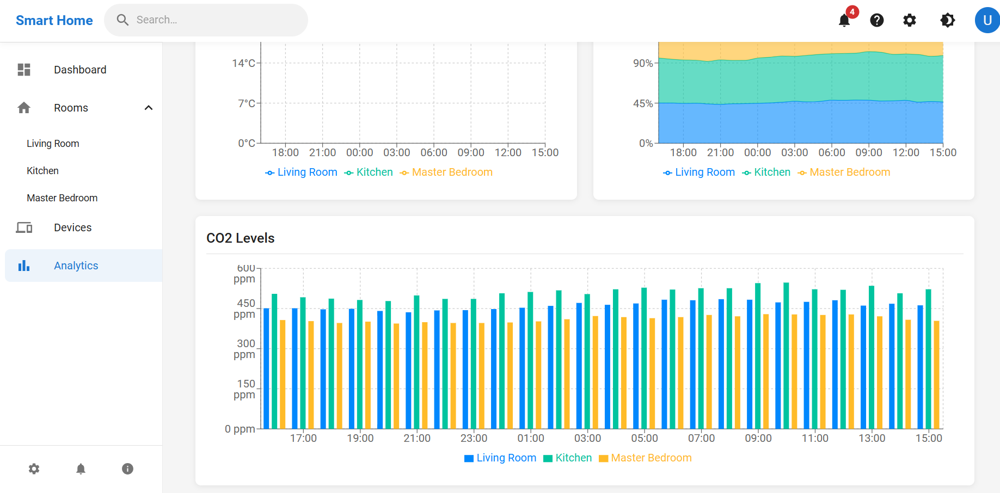

# Smart Home Digital Twin

<p align="center">
    <a href="https://github.com/yourusername/smart-home-digital-twin">
        
    </a>
</p>

Smart Home Digital Twin is a comprehensive IoT monitoring and visualization platform that creates real-time digital representations of smart home environments using FIWARE technology stack.

---

## Table of Contents
- [Project Overview](#project-overview)
  - [Context & Purpose](#context--purpose)
  - [Key Components](#key-components)
  - [System Architecture](#system-architecture)
- [Folder Structure](#folder-structure)
- [JSON Data Models](#json-data-models)
- [Features](#features)
- [Prerequisites](#prerequisites)
- [Installation Process](#installation-process)
- [How to Launch the Application](#how-to-launch-the-application)
- [Results & Screenshots](#results--screenshots)
- [Contributing](#contributing)
- [References & Resources](#references--resources)

---

## Project Overview

### Context & Purpose

The Smart Home Digital Twin project addresses the growing need for intelligent home automation and monitoring systems. In the context of modern IoT ecosystems, this solution provides:

- **Real-time Environmental Monitoring**: Track temperature, humidity, CO2 levels, noise, and occupancy across multiple rooms
- **Digital Twin Technology**: Create virtual representations of physical spaces with live data synchronization
- **FIWARE Integration**: Leverage industry-standard Context Broker for IoT data management
- **Scalable Architecture**: Containerized microservices for easy deployment and scaling

This project demonstrates the implementation of a complete IoT monitoring solution suitable for smart homes, commercial buildings, or any environment requiring continuous environmental monitoring.

<p align="center">
    
</p>

### Key Components

- **Orion Context Broker**: FIWARE component managing contextual information and entity lifecycle
- **MongoDB**: NoSQL database storing entity data and historical information
- **React Frontend**: Modern web application providing intuitive data visualization
- **Nginx**: Reverse proxy handling routing and load balancing
- **Data Simulation Scripts**: Node.js scripts generating realistic sensor data

### System Architecture

The application follows a microservices architecture with clear separation of concerns:

- **Data Layer**: MongoDB for persistence, Orion Context Broker for real-time data management
- **Business Layer**: FIWARE Orion handling entity operations and data context
- **Presentation Layer**: React application with real-time updates and interactive dashboards
- **Infrastructure Layer**: Docker containers orchestrated via Docker Compose

---

## Folder Structure

```text
├── docker-compose.yml               # Docker Compose orchestration configuration
├── .gitignore                       # Git ignore rules for clean repository
├── README.md                        # Project documentation
├── package.json                     # Root package configuration
│
├── frontend/                        # React-based web application
│   ├── Dockerfile                   # Frontend container configuration
│   ├── package.json                 # Frontend dependencies
│   ├── public/                      # Static assets and HTML template
│   │   ├── index.html              # Main HTML template
│   │   ├── manifest.json           # PWA manifest
│   │   └── models/                  # 3D models for visualization
│   │       ├── house.glb           # 3D house model
│   │       └── README.md           # Model documentation
│   └── src/                        # React source code
│       ├── App.js                  # Main application component
│       ├── index.js                # Application entry point
│       ├── components/             # Reusable UI components
│       │   ├── Navbar.js          # Navigation bar component
│       │   └── Sidebar.js         # Sidebar navigation
│       └── pages/                  # Application pages
│           ├── Analytics.js        # Analytics dashboard
│           ├── Dashboard.js        # Main dashboard
│           ├── DeviceControl.js    # Device control interface
│           └── RoomView.js         # Individual room view
│
├── nginx/                          # Reverse proxy configuration
│   ├── default.conf                # Main Nginx configuration
│   └── nginx.conf                  # Additional Nginx settings
│
├── scripts/                        # Data provisioning and simulation
│   ├── package.json                # Scripts dependencies
│   ├── provision.js                # Initial data setup
│   ├── simulate-data.js            # Real-time data simulation
│   └── create-subscriptions.js     # FIWARE subscriptions setup
│
└── example/                        # Screenshots and documentation assets
    ├── dashboard.png               # Main dashboard screenshot
    ├── Room.png                    # Room view screenshot
    ├── Analytics1.png              # Analytics view 1
    └── Analytics2.png              # Analytics view 2
```

---

## JSON Data Models

### Room Entity Structure

The core data model represents smart home rooms with comprehensive sensor data:

```json
{
  "id": "urn:ngsi-ld:Room:LivingRoom",
  "type": "Room",
  "name": { 
    "value": "Living Room", 
    "type": "Text" 
  },
  "temperature": { 
    "value": 21.5, 
    "type": "Number",
    "metadata": {
      "unit": { "value": "Celsius" }
    }
  },
  "humidity": { 
    "value": 45, 
    "type": "Number",
    "metadata": {
      "unit": { "value": "%" }
    }
  },
  "illuminance": { 
    "value": 1000, 
    "type": "Number",
    "metadata": {
      "unit": { "value": "lux" }
    }
  },
  "occupancy": { 
    "value": true, 
    "type": "Boolean" 
  },
  "co2Level": { 
    "value": 450, 
    "type": "Number",
    "metadata": {
      "unit": { "value": "ppm" }
    }
  },
  "noiseLevel": { 
    "value": 35, 
    "type": "Number",
    "metadata": {
      "unit": { "value": "dB" }
    }
  }
}
```

### API Response Examples

#### GET /orion/v2/entities
Returns all room entities in the system:
```json
[
  {
    "id": "urn:ngsi-ld:Room:LivingRoom",
    "type": "Room",
    "name": { "value": "Living Room", "type": "Text" },
    "temperature": { "value": 21.5, "type": "Number" },
    "humidity": { "value": 45, "type": "Number" },
    "illuminance": { "value": 1000, "type": "Number" },
    "occupancy": { "value": true, "type": "Boolean" },
    "co2Level": { "value": 450, "type": "Number" },
    "noiseLevel": { "value": 35, "type": "Number" }
  },
  {
    "id": "urn:ngsi-ld:Room:Kitchen",
    "type": "Room",
    "name": { "value": "Kitchen", "type": "Text" },
    "temperature": { "value": 23.0, "type": "Number" },
    "humidity": { "value": 50, "type": "Number" },
    "illuminance": { "value": 800, "type": "Number" },
    "occupancy": { "value": false, "type": "Boolean" },
    "co2Level": { "value": 500, "type": "Number" },
    "noiseLevel": { "value": 45, "type": "Number" }
  },
  {
    "id": "urn:ngsi-ld:Room:MasterBedroom",
    "type": "Room",
    "name": { "value": "Master Bedroom", "type": "Text" },
    "temperature": { "value": 20.5, "type": "Number" },
    "humidity": { "value": 55, "type": "Number" },
    "illuminance": { "value": 0, "type": "Number" },
    "occupancy": { "value": false, "type": "Boolean" },
    "co2Level": { "value": 400, "type": "Number" },
    "noiseLevel": { "value": 25, "type": "Number" }
  }
]
```

---

## Features

- **Real-time Data Visualization**
  - Live updates of environmental sensors across multiple rooms
  - Interactive dashboard with responsive design
  - 3D visualization of smart home layout

- **FIWARE-based Architecture**
  - Industry-standard Context Broker for IoT data management
  - NGSI-v2 API compliance for interoperability
  - Scalable entity management system

- **Multi-room Monitoring**
  - Temperature, humidity, and air quality tracking
  - Occupancy detection and noise level monitoring
  - Illuminance measurement for lighting optimization

- **Analytics & Insights**
  - Historical data analysis and trends
  - Real-time charts and visualizations
  - Customizable dashboards for different user roles

- **Containerized Deployment**
  - Full Docker containerization for easy deployment
  - Microservices architecture for scalability
  - Production-ready configuration with Nginx reverse proxy

---

## Prerequisites

Before you begin, ensure you have the following installed:

- **Docker** (version 19.03.0+)
- **Docker Compose** (version 1.27.0+)
- **Node.js** (version 14.0.0+)
- **npm** (version 6.0.0+)

**Optional:**
- **Git** (for cloning repository)

---

## Installation Process

### 1. Clone the Repository

```bash
git clone https://github.com/yourusername/smart-home-digital-twin.git
cd smart-home-digital-twin
```

### 2. Install Dependencies

Install the required Node.js packages for the data simulation scripts:

```bash
cd scripts
npm install
cd ..
```

### 3. Docker Compose Configuration

The `docker-compose.yml` file orchestrates all services required for the Smart Home Digital Twin:

```yaml
services:
  # MongoDB - Database for Orion Context Broker
  mongodb:
    image: mongo:4.4
    container_name: mongodb
    ports:
      - "27017:27017"
    networks:
      - fiware
    volumes:
      - mongodb_data:/data/db
    healthcheck:
      test: echo 'db.runCommand("ping").ok' | mongosh localhost:27017/test --quiet
      interval: 10s
      timeout: 10s
      retries: 3

  # Orion Context Broker - FIWARE Component
  orion:
    image: fiware/orion:3.0.0
    container_name: orion
    depends_on:
      - mongodb
    networks:
      - fiware
    ports:
      - "1026:1026"
    command: -dbhost mongodb -logLevel DEBUG
    healthcheck:
      test: curl --fail -s http://localhost:1026/version || exit 1
      interval: 30s
      timeout: 10s
      retries: 3

  # Frontend Application - React Dashboard
  frontend:
    build:
      context: ./frontend
      dockerfile: Dockerfile
    container_name: frontend
    networks:
      - fiware
    ports:
      - "3000:3000"
    volumes:
      - ./frontend:/app
      - /app/node_modules
    environment:
      - NODE_ENV=development
      - PORT=3000
      - REACT_APP_ORION_API=/orion
    command: npm start

  # Nginx - Reverse Proxy
  nginx:
    image: nginx:alpine
    container_name: nginx
    networks:
      - fiware
    ports:
      - "80:80"
    volumes:
      - ./nginx/default.conf:/etc/nginx/conf.d/default.conf:ro
    depends_on:
      - frontend
      - orion

networks:
  fiware:
    driver: bridge

volumes:
  mongodb_data:
```

**Key Components Explained:**
- **MongoDB**: Stores entity data and provides persistence for the Orion Context Broker
- **Orion Context Broker**: FIWARE component that manages contextual information using NGSI-v2 API
- **Frontend**: React application providing the user interface for data visualization
- **Nginx**: Reverse proxy that routes requests between frontend and backend services
- **Networks**: Custom bridge network for secure communication between containers
- **Volumes**: Persistent storage for MongoDB data

---

## How to Launch the Application

### Step 1: Build and Start All Services

Start all services using Docker Compose:

```bash
docker-compose up --build -d
```

This command will:
- Build the frontend Docker image
- Pull required images (MongoDB, Orion, Nginx)
- Create the network and volumes
- Start all containers in detached mode

### Step 2: Verify Services are Running

Check that all containers are running correctly:

```bash
docker-compose ps
```

All services should show as "Up" status.

### Step 3: Provision Initial Data

Load the initial room data into the system:

```bash
cd scripts
node provision.js
cd ..
```

### Step 4: Start Real-time Data Simulation

Run the data simulation script to generate real-time sensor updates:

```bash
cd scripts
node simulate-data.js
```

Keep this script running to continuously update sensor values.

### Step 5: Access the Dashboard

Open your web browser and navigate to:

```
http://localhost
```

The Smart Home Digital Twin dashboard should now be accessible and displaying real-time room data.

---

## Results & Screenshots

### Main Dashboard View
The main dashboard provides an overview of all rooms with their current environmental conditions:


**Features displayed:**
- Real-time temperature, humidity, and CO2 levels for each room
- Occupancy status indicators
- Quick navigation to detailed room views
- Responsive design for different screen sizes

### Individual Room Detail View
Detailed sensor information for specific rooms with historical data trends:



**Features displayed:**
- Comprehensive sensor readings with units
- Real-time updates every few seconds
- Historical data visualization
- Environmental condition status indicators

### Analytics Dashboard Views
Advanced analytics showing data trends and patterns across the smart home:





**Features displayed:**
- Multi-room comparison charts
- Historical trend analysis
- Environmental correlation insights
- Data export capabilities

---

## Contributing

We welcome contributions to enhance the Smart Home Digital Twin's monitoring, visualization, and IoT capabilities. To contribute:

1. Fork this repository
2. Create a new branch:
   ```bash
   git checkout -b feature/<your-feature-name>
   ```
3. Implement your feature or fix
4. Commit with a clear, descriptive message
5. Push to your fork and open a Pull Request

---

## References & Resources

You can use these resources to extend, customize, and troubleshoot your deployment:

- [FIWARE Orion Context Broker Documentation](https://fiware-orion.readthedocs.io/)
- [NGSI-v2 API Documentation](https://fiware.github.io/specifications/ngsiv2/stable/)
- [Docker Documentation](https://docs.docker.com/guides/)
- [React Documentation](https://reactjs.org/docs/)
- [MongoDB Documentation](https://docs.mongodb.com/)
- [Nginx Documentation](https://nginx.org/en/docs/)
- [Node.js Documentation](https://nodejs.org/en/docs/)

### Troubleshooting

#### Connection Issues

If you cannot access the dashboard:

1. **Check Docker containers status**:
   ```bash
   docker-compose ps
   ```
   All containers should show as "Up"

2. **Check Nginx logs**:
   ```bash
   docker-compose logs nginx
   ```

3. **Check Orion Context Broker logs**:
   ```bash
   docker-compose logs orion
   ```

#### Data Not Displaying

If the dashboard doesn't show sensor data:

1. Verify provisioning script ran successfully:
   ```bash
   node scripts/provision.js
   ```

2. Ensure data simulation is running:
   ```bash
   node scripts/simulate-data.js
   ```

3. Check browser console for frontend errors

#### Restarting the System

To restart all services:

```bash
docker-compose down
docker-compose up -d
cd scripts
node provision.js
node simulate-data.js
```